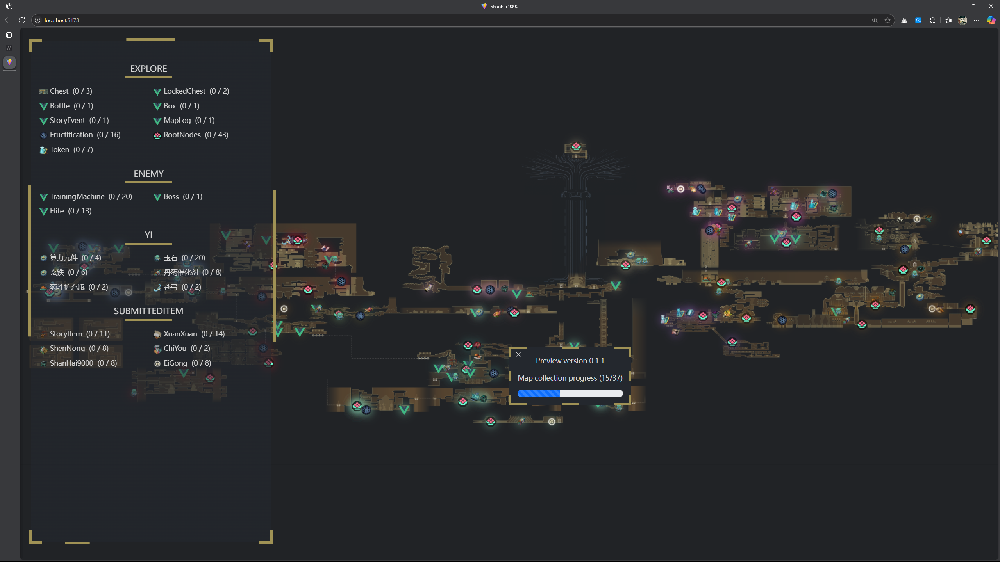

# Shanhai 9000 Web Map

 | 地图收集进度 (15/37) 

[English](README_en.md) |  Chinese(CN)

另一张《九日》网页版地图

和其他网页版本地图一样，可以自由隐藏图标

## 功能

~~隐藏一类图标(该有的功能)~~

单独淡化(隐藏)一个图标

淡化后可在控制面板中查看收集进度

侧拉式控制面板

其他功能正在开发(尤其新手引导)

## 此些地图将会收集

- 探索类(箱子，令牌，资料信息，瓶子，甚至可破坏箱子，...)
- 玄蝶交互位置 (切换，绳索，破解点)
- 任务物品 (图资芯片，蚩尤任务物品，神农，轩轩，...)
- 解谜 (钟,玄蝶,副本)
- 具体请看 `src/assets/location`中的yaml文件....

## For Developer

此项目使用  `npm 10.9.0` ,需要 `Python` 环境，并且安装 `pyyaml` 库

如果在 linx/unix中运行 ,需要 `gdal-bin` 软件包.

如果在 windows中运行, 请使用 osgeo4w setup Tools.

\* 运行 `npm run install`  安装依赖

\* 运行 `npm run updateMarker` 更新标记点（因为工作分支不同）

\* 运行 `npm run splitMap` 使用 [GDAL](https://gdal.org/en/stable/) 分割地图

如果想要制作静态网页，先顺利完成前三项命令。然后运行 `npm run build`. 目标位置在 `dist/index.html`

当前地图测绘任务已移交至 `Map-making` 分支管理

## For User

恭喜，不需要过多繁琐操作，**但当前没有发布任何release版本**

## Demo

`v0.1.0-video.mp4`
[file](image/v0.1.0-video.mp4)

`v0.1.2.png`

## 当前计划

- [X] **美化UI(暂时的)**
- [ ] 获取图标ui
- [ ] 清理代码qwq
- [X] 可以单独隐藏一个图标，并且存储以下次打开 ^1^
- [ ] 可能会增加css动画
- [ ] **增加向导**
- [ ] 本地化界面
- [ ] 英文本地化界面
- [ ] 动态放大缩小图标
- [ ] 增加一键隐藏按钮
- [ ] 其他计划

Note:

1. 不确定 `file://`协议是否支持cookies，更多声音说此协议使用cookies对于不同的浏览器支持不同

**重要声明:  `/public/marks` 文件夹中大部分素材来源于游戏资源**
