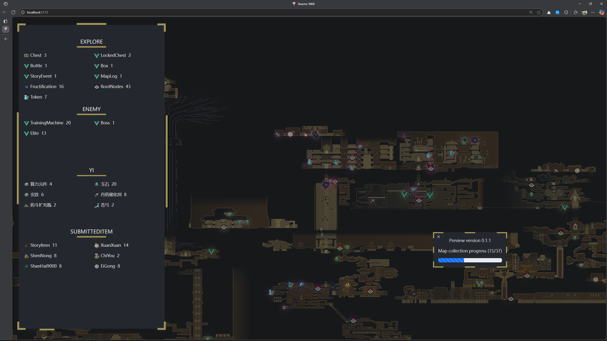

# Shanhai 9000 Web Map

 | Map collection progress (15/37) 

English | [Chinese(CN)](README.md)

Another web version of the "NineSols" map.

Like other web game maps, it can choose to hide markers.

## Functions
~~Hide a type of icon (the necessary function)~~
Individually fade (hide) an icon
After fading, the collection progress can be viewed in the control panel
Side pull control panel
Other features are under development (especially beginner guidance)

This map will collect:

- explore (chest,lockedChest,bottle,StoryEvent,etc...)
- NYMPH Interaction (Switch,rope,hackPoint)
- questItem (StoryItem,etc...)
- puzzle  (bell,NYMPH Puzzle,zone)
- etc...

## For Developer

This program use  `npm 10.9.0` ,require `Python` in PATH and install `pyyaml` library

If running in linx/unix ,should install `gdal-bin` library.

If running windows, should use osgeo4w setup Tools.

Whether you use `apt-get, brew, yum, dpkg or even opkg` - as long as `gdal2tiles.py` in PATH and runs properly, you're always right!

\* Run `npm run install`  to install dependency package.

\* Run `npm run updateMarker` to convert json.

\* Run `npm run splitMap` to use [GDAL](https://gdal.org/en/stable/) to spilt map

To make static web ,run the ablove three frist. Then `npm run build`. Target file is `dist/index.html`

Currently, updates regarding map markers have been moved to the `Map making` branch

## For User

Congratulations! Jump to Releases page download. **(There are currently no releases available)**

## Demo

`v0.1.0-video.mp4`
[file](image/v0.1.0-video.mp4)

`v0.1.2.png`

## Current direction

- [X] **Beautify UI interface**
- [ ] Make icon for each marker
- [ ] Clean up program Code
- [X] Can hide individual tags and use cookies to store hidden tags ^1^
- [ ] Perhaps CSS animations will be added
- [ ] Localized Chinese(ZH_CN&ZH_TW) interface
- [ ] Localized English interface
- [ ] Dynamic zoom in/out icon
- [ ] Add a one-click hide button
- [ ] **Add Wizard**
- [ ] etc...

Note:

1. I'm not sure if local files can store cookies, but the AI's answer tells me that not all browsers support them by default

**Important: Most of the contents in the `/public/marks` are in-game resources**
